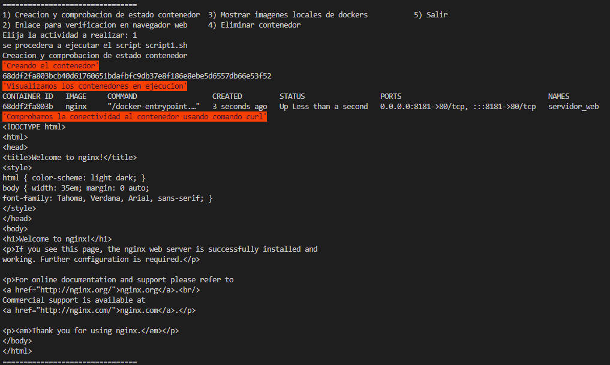
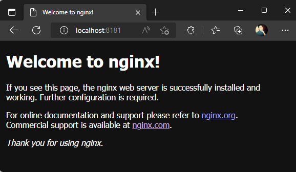
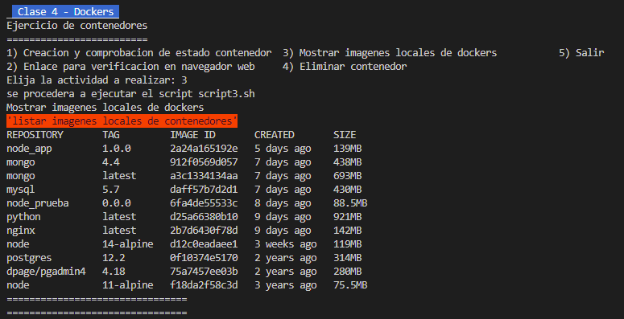
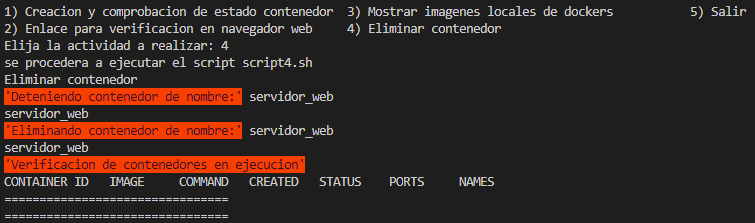

# Solución reto 1
Para resolver el ejercicio se procedio a implementar un script principal de nombre **reto1.sh** como menú gestor de scripts con diferenciones opciones a ejecutar

## Ejercicio Inicial
se crea un contenedor con las siguientes caracteristicas
- **Imagen Base**: nginx 
- **Nombre Contenedor**: servidor_web 
- **Puerto**: 8181

script bash to docker:  

https://github.com/wnervhq/bootcamp-3-challenge/blob/ffa1913c69371bd81b888e0077ea9c72eb12dbc4/reto1/scripts/script1.sh

## Desarrollo 
1. Pantallazo donde se vea la creación del contenedor y podamos comprobar que el contenedor está funcionando.

    

2. Pantallazo donde se vea el acceso al servidor web utilizando un navegador web (recuerda que tienes que acceder a la ip del ordenador donde tengas instalado
docker)

    

3. Pantallazo donde se vean las imágenes que tienes en tu registro local.

    

4. Pantallazo donde se vea cómo se elimina el contenedor (recuerda que antes debe
estar parado el contenedor).

    