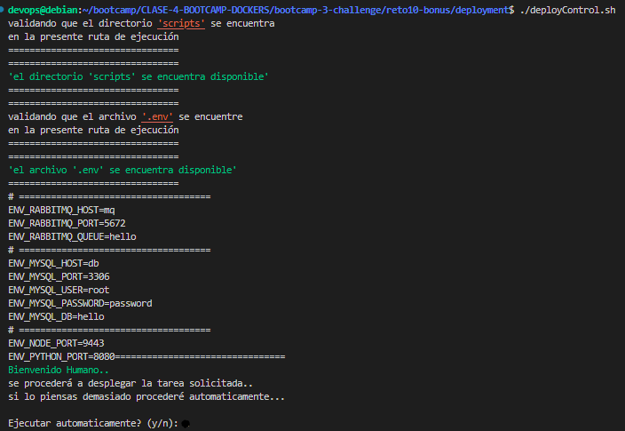
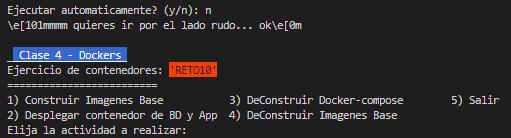
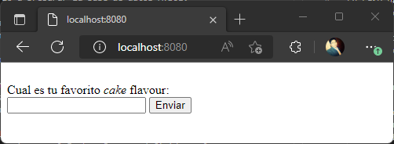
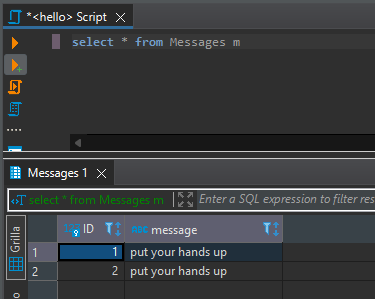

# Solución reto 10
Para resolver el ejercicio se procedio a implementar un script principal de nombre **deployControl.sh** como menú gestor de scripts con diferenciones opciones a ejecutar. 

si ejecutamos **deployControl.sh** este procederá a revisar que se tenga la carpeta de scripts en la carpeta deployment y que tengamos el archivo ``.env`` creado, de no ser el caso se procedera a copiar automaticamente del archivo ``.env.example`` y el proceso seguira con la construccion de las images de de los contenedores para continuar con su despliegue de forma automatica y mostrando cada paso.

   

Tambien podemos obtar por acceder al menu de acciones, si continuamos por este lado primero seleccionamos la opcion 1 que construye las imagenes base y luego continuamos con la opcion 2 par el el depliege de los contenedores

   

En caso hay desconfianza :laughing: de que haga mi script :sweat_smile:  **deployControl.sh** podemos tomar el camino tradicional de 

Paso 1:
- verificar que exista el archivo .env y cuente con la misma estructura que el archivo .env.example dentro de la carpeta deployment   

Paso 2:
- estando en la carpeta deployment ejecutamos el siguiente comando   
    ``docker-compose build``

Paso 3
- procedemos con el comando (ejecutará en primer plano los contenedores)   
    ``docker-compose up`` 
- tambien podemos optar por ejectuar en segundo plano   
    ``docker-compose up -d``

Paso 4   
- ingresar en el navegador   
http://localhost:8080/
    

## Se hicieron las siguientes modificaciones   
    
1. carpeta ``deployment``:
    - se agregó ``scripts`` para uso del menu principal ``deployControl.sh``
    - se agregó ``.env`` donde se guardan las variables de entorno (al respositorio solo se copio el archivo ``.env.example`` para tomar como referencia base)
    - se modificó el archivo ``docker-compose.yaml`` para uso del archivo ``.env`` asi mismo se agregó
        - En servicio ``db`` se agrega el volumen db para tener persistencia de datos y de especifica el script sql a ejecutarse al momento del despliegue.
        - En servicio ``mq`` se modificó la linea de Port para que tome el valor del archivo ``.env``
        - En servicio ``hello-node`` se retira los volumenes declarados ya este despliegue es para produccion, si fuese para desarrollo se podria habilitar el volumen, este item al estar activo era lo que inicialmente provocaba el error de falta de dependencias, tambien se agregó la ejecución del archivo ``vestidoAzul.sh`` para el control de arranque y espera del resto de servicios necesarios para levantar ``hello-node`` (se valida que la bd esté operativa y reciba conexiones luego que el servicio de colas este disponible)
        - En servicio ``hello-python`` tambien se retiró volumenes y se implementó el uso de variable de entorno

    https://github.com/wnervhq/bootcamp-3-challenge/blob/609feb4504338db5097e53b2de3dcb7c3553afe1/reto10-bonus/deployment/docker-compose.yaml#L1-L80

2. carpeta ``hello-node``:
    - se agregó una carpeta ``scripts`` con instruccion para la espera de los servicios dependientes
    - se modificó el archivo ``Dockerfile`` agregando ``mysql-client`` para validar el status de la DB asi como la copia de los scripts de validacion previamente mencionados   

    https://github.com/wnervhq/bootcamp-3-challenge/blob/609feb4504338db5097e53b2de3dcb7c3553afe1/reto10-bonus/hello-node/Dockerfile#L1-L23

3. carpeta ``hello-python``:
    - se modificó el archivo ``Dockerfile`` la linea de FROM para hacer referencia a una imagen estable, la imagen inicial era un alpha, tambien se actualizó el contenedor y se agregó el uso de de ``pip-compile`` para el manejo automatizado de dependencias
    - se agregó el archivo ``requeriments.in`` para uso de ``pip-compile``   

    https://github.com/wnervhq/bootcamp-3-challenge/blob/609feb4504338db5097e53b2de3dcb7c3553afe1/reto10-bonus/hello-python/Dockerfile#L1-L17

4. como resultado obtuvimos la aplicacion corriendo   

       
       

