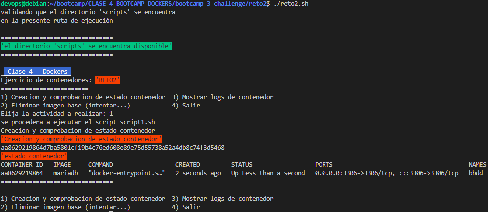
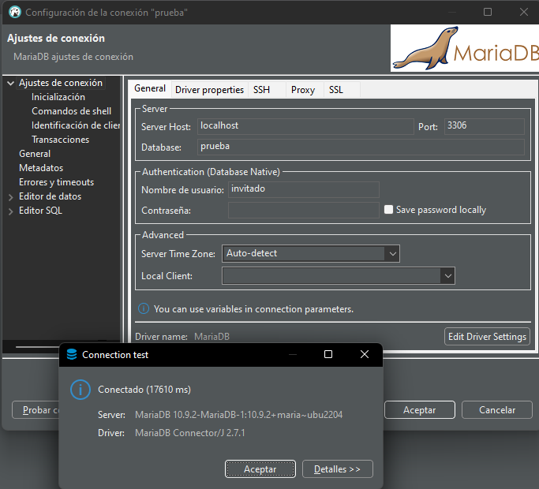
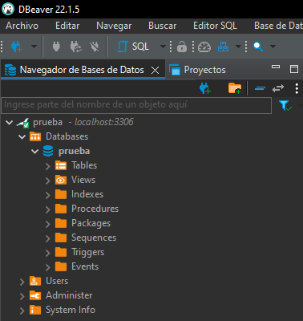
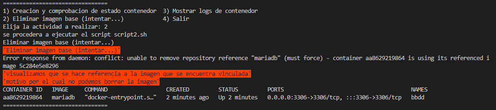

# Solución reto 2
Para resolver el ejercicio se procedio a implementar un script principal de nombre **reto2.sh** como menú gestor de scripts con diferenciones opciones a ejecutar

## Ejercicio Inicial
se crea un contenedor con las siguientes caracteristicas
- **Imagen Base**: mariadb 
- **Nombre Contenedor**: bbdd 
- **Puerto**: 3306

script bash to docker:  

https://github.com/wnervhq/bootcamp-3-challenge/blob/62987ed41a81a234d77c10ac3246f421004f66d4/reto2/scripts/script1.sh#L1-L14

## Desarrollo 
1. Arrancar un contenedor que se llame `bbdd` y que ejecute una instancia de la imagen **mariadb** para que sea accesible desde el puerto 3306. Establecer variables de entorno.

    Lanzamos el comando en primer plano para poder leer los posibles mensajes de error que puedan surgir mientras trabajamos desde otra consola.  
    - en esta ocacion lo lanzaremos en segundo plano usando el argumento '-d'  
    - se agregará otro script para visualizar los logs del contenedor ejecutado  

    

2. Pantallazo de la conexión al servidor de base de datos con el usuario creado y de la base de datos `prueba` creada automáticamente.

    

Y comprobamos que podemos acceder a la base de datos y que nuestro esquema `prueba` está creado

Use Gestor de Base de Datos
- DBeaver Community [Descarga](https://dbeaver.io/)

    

3. Pantallazo donde se comprueba que no se puede borrar la imagen `mariadb` mientras el contenedor `bbdd` está creado.

    