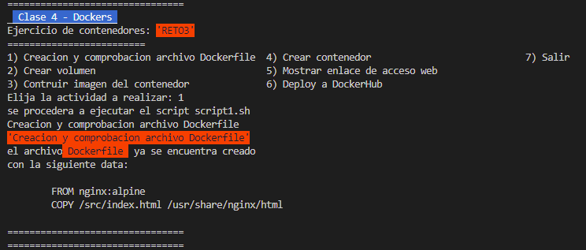
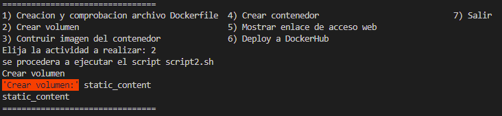
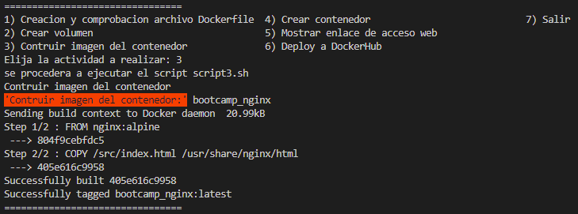
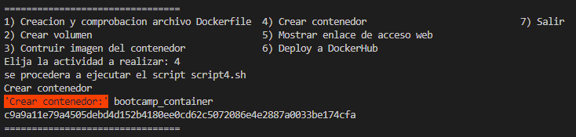
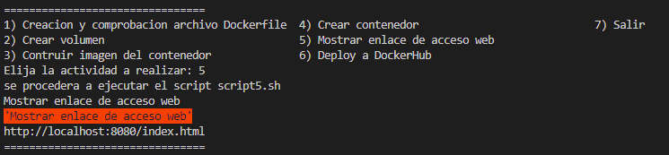
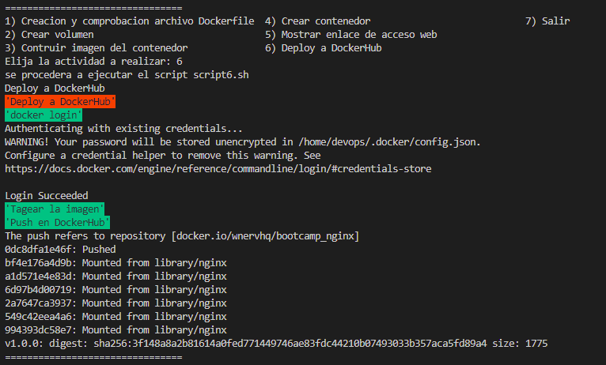

# Solución reto 3
Para resolver el ejercicio se procedio a implementar un script principal de nombre **reto3.sh** como menú gestor de scripts con diferenciones opciones a ejecutar

## 3.- Crea un contenedor con las siguientes especificaciones:
	a. Utilizar la imagen base NGINX haciendo uso de la version nginx:alpine
	b. Al acceder a la URL localhost:8080/index.html aparecer el mensaje HOMEWORK 1
	c. Persistir el fichero index.html en un volumen llamado static_content

se crea un contenedor con las siguientes caracteristicas
- **Imagen Base**: nginx:alpine 
- **Nombre Contenedor**: bootcamp_container 
- **Puerto**: 8080
- **Volumen**: static_content
- **Nombre Imagen del Contenedor**: bootcamp_nginx

## Desarrollo 
### Paso 1: Crear el fichero Dockerfile. Las instrucciones que se han utilizado para el fichero son:
```
	- Utilizar la imagen de nginx con la version requerida
	FROM nginx:alpine
	
	- Copiar el archivo index.htm de la carpeta src desde el host a la carpeta del contenedor
	COPY /src/index.html /usr/share/nginx/html
```	
https://github.com/wnervhq/bootcamp-3-challenge/blob/f03c85f78b9c8a4815a60712cf78eebce2430ec5/reto3/scripts/script1.sh#L1-L23



### Paso 2: Crear un volumen 'static_content' en el CLI de Docker mediante la siguiente instruccion
	
https://github.com/wnervhq/bootcamp-3-challenge/blob/f03c85f78b9c8a4815a60712cf78eebce2430ec5/reto3/scripts/script2.sh#L1-L5



### Paso 3: Construir la imagen del contenedor. El nombre de la imagen es 'bootcamp_nginx'
	
https://github.com/wnervhq/bootcamp-3-challenge/blob/f03c85f78b9c8a4815a60712cf78eebce2430ec5/reto3/scripts/script3.sh#L1-L5

	

### Paso 4: Crear el contenedor	con nombre 'bootcamp_container' utilizando la imagen construida en el paso 3
	- Mediante el parametro -v hacemos que el volumen 'static_content' creado en el paso 2 apunte al directorio del contenedor donde se encuentra el archivo index.html. De esta forma persistimos todo el contenido del directorio /usr/share/nginx/html del contenedor en el volumen

https://github.com/wnervhq/bootcamp-3-challenge/blob/f03c85f78b9c8a4815a60712cf78eebce2430ec5/reto3/scripts/script4.sh#L1-L7	

	

### Paso 5: Acceder a la URL http://localhost/8080/index.html y comprobar que aparece la pagina deseada

https://github.com/wnervhq/bootcamp-3-challenge/blob/f03c85f78b9c8a4815a60712cf78eebce2430ec5/reto3/scripts/script5.sh#L1-L5



### Paso 6: Deploy to Registry DockerHub

https://github.com/wnervhq/bootcamp-3-challenge/blob/f03c85f78b9c8a4815a60712cf78eebce2430ec5/reto3/scripts/script6.sh#L1-L13



podemos descargar el contenedor usando el siguiente comando  
```$ docker pull wnervhq/bootcamp_nginx```    