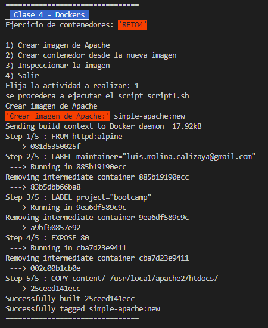
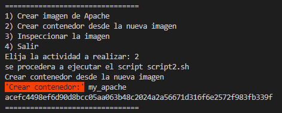
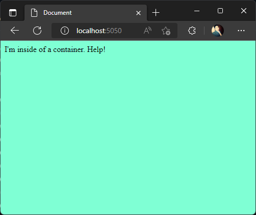
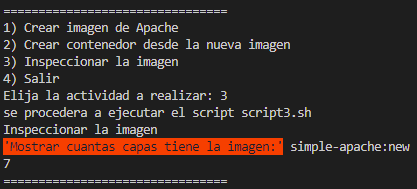

# Solución reto 4
Para resolver el ejercicio se procedio a implementar un script principal de nombre **reto4.sh** como menú gestor de scripts con diferenciones opciones a ejecutar

se crea un contenedor con las siguientes caracteristicas
- **Imagen Base**: httpd:alpine 
- **Nombre Contenedor**: my_apache 
- **Puerto**: 5050
- **Nombre Imagen del Contenedor**: simple-apache:new

## Desarrollo 

### Ejercicio 1 - Crear imagen de `Apache`
Crea una imagen con un servidor web Apache y el mismo contenido que en la carpeta [content](https://raw.githubusercontent.com/roxsross/bootcamp-3-challenge/master/retos/sesion2/content).

Usa docker build para crear la imagen llamada  

https://github.com/wnervhq/bootcamp-3-challenge/blob/0a73512deced24d7f87d3cc0ef7211cff42d1ec8/reto4/scripts/script1.sh#L1-L5

1. Cambiar
2. Buscar en ```Docker Hub``` la imagen de ```Apache```
3. Cambiar los valores para que:
   1. La imagen base sea este otro servidor
   2. El contenido se copie donde apache sirve los archivos.
	
	https://github.com/wnervhq/bootcamp-3-challenge/blob/0a73512deced24d7f87d3cc0ef7211cff42d1ec8/reto4/Dockerfile#L3-L14

	


### Ejercicio 2 - Crear contenedor desde la nueva imagen

Ejecutar tu nueva imagen
El contenedor se debe llamar ```my_apache```
Debes usar el puerto __5050__ de tu __localhost__ para poder acceder a él.
__Resultado:__

https://github.com/wnervhq/bootcamp-3-challenge/blob/0a73512deced24d7f87d3cc0ef7211cff42d1ec8/reto4/scripts/script2.sh#L1-L7

_
	
	

### Ejercicio 3 - Inspeccionar la imagen

Averiguar cuántas capas tiene mi nueva imagen

https://github.com/wnervhq/bootcamp-3-challenge/blob/0a73512deced24d7f87d3cc0ef7211cff42d1ec8/reto4/scripts/script3.sh#L1-L7

