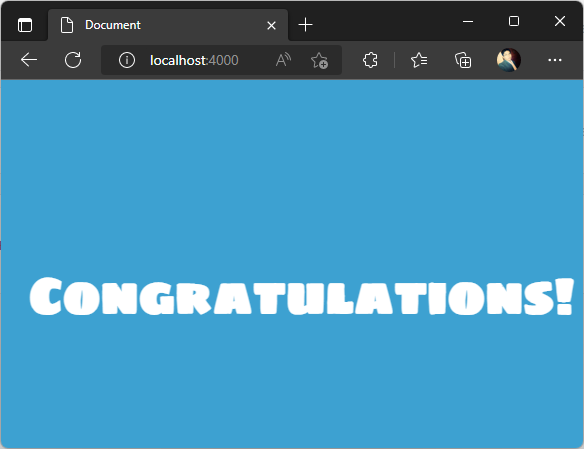
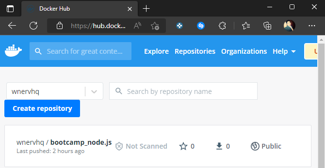
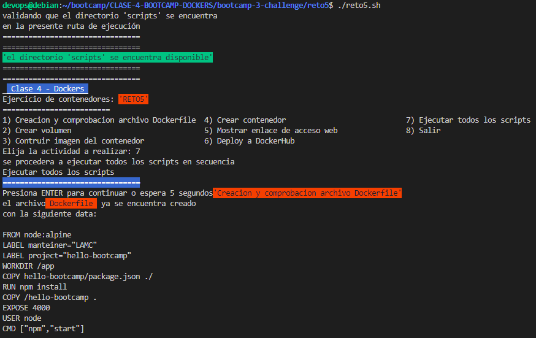
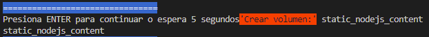
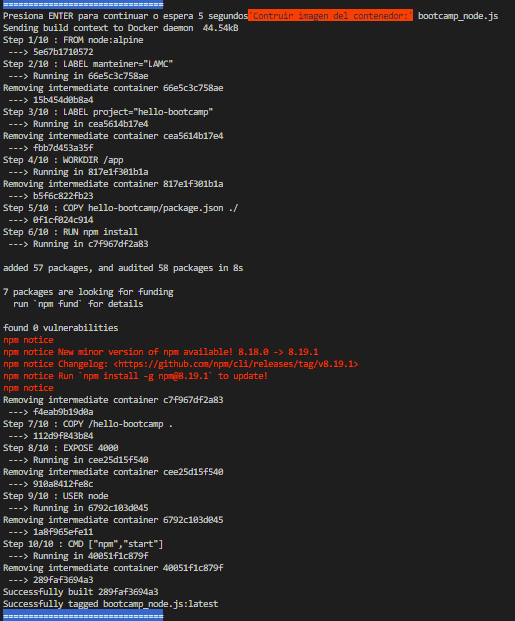
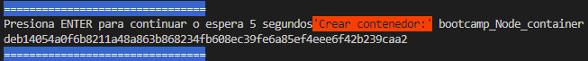
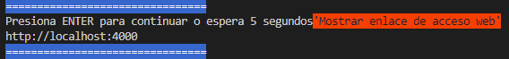
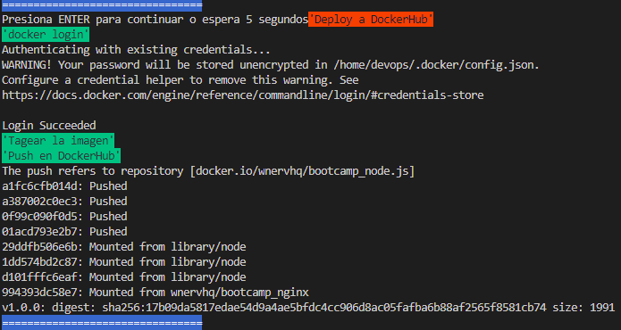

# Solución reto 5
Para resolver el ejercicio se procedio a implementar un script principal de nombre **reto5.sh** como menú gestor de scripts con diferenciones opciones a ejecutar.  

	Tener en cuenta que en el script principal reto5.sh la `opción 7` permite ejecutar todos los scripts en conjunto y secuencialmente.

se crea un contenedor con las siguientes caracteristicas
- **Imagen Base**: node:alpine 
- **Nombre Contenedor**: bootcamp_Node_container 
- **Puerto**: 4000
- **Volumen**: static_nodejs_content
- **Nombre Imagen del Contenedor**: bootcamp_node.js

## Desarrollo 

### Ejercicio 1 - Containerizar aplicacion `Node.js`

Dockeriza la carpeta [hello-bootcamp](https://raw.githubusercontent.com/roxsross/bootcamp-3-challenge/master/reto5/hello-bootcamp/index.html)

- Ejecuta un contenedor con la imagen


- Subir la aplicacion en registry


	podemos descargar el contenedor usando el siguiente comando  
	```$ docker pull wnervhq/bootcamp_node.js```    

- Crear el Script que permita realizar todo lo antes mencionado

	https://github.com/wnervhq/bootcamp-3-challenge/blob/228a89dc9e153572cb87b8cdce74c078772c6365/reto5/scripts/script1.sh#L1-L35

	

	https://github.com/wnervhq/bootcamp-3-challenge/blob/228a89dc9e153572cb87b8cdce74c078772c6365/reto5/scripts/script2.sh#L1-L5

	

	https://github.com/wnervhq/bootcamp-3-challenge/blob/228a89dc9e153572cb87b8cdce74c078772c6365/reto5/scripts/script3.sh#L1-L5

	

	https://github.com/wnervhq/bootcamp-3-challenge/blob/228a89dc9e153572cb87b8cdce74c078772c6365/reto5/scripts/script4.sh#L1-L7

	

	https://github.com/wnervhq/bootcamp-3-challenge/blob/228a89dc9e153572cb87b8cdce74c078772c6365/reto5/scripts/script5.sh#L1-L5

	

	https://github.com/wnervhq/bootcamp-3-challenge/blob/228a89dc9e153572cb87b8cdce74c078772c6365/reto5/scripts/script6.sh#L1-L13

	

