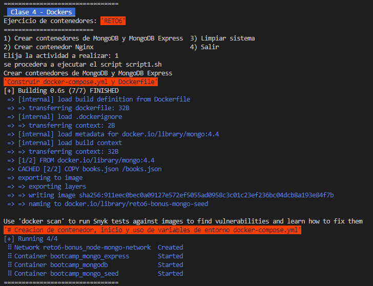
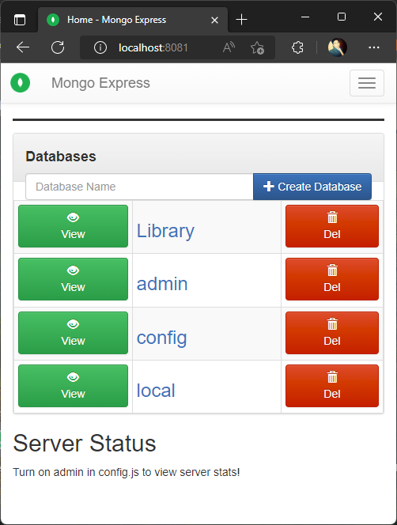
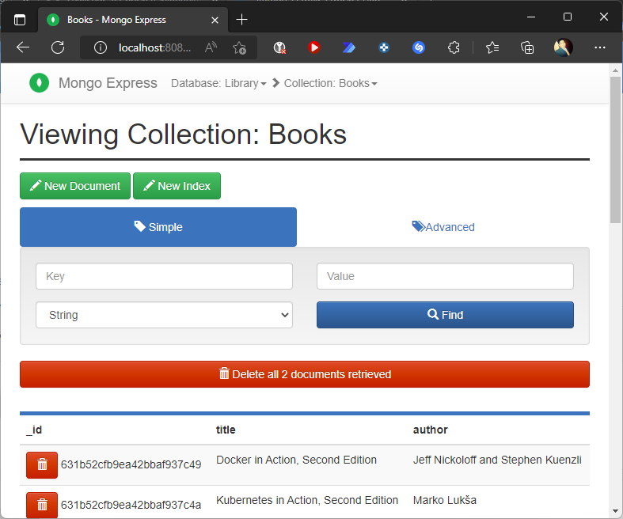
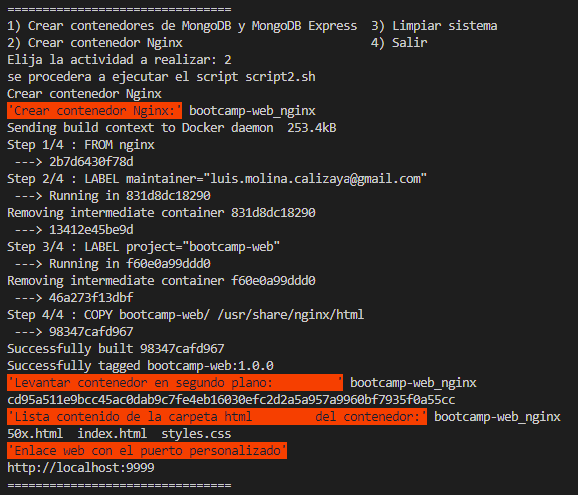
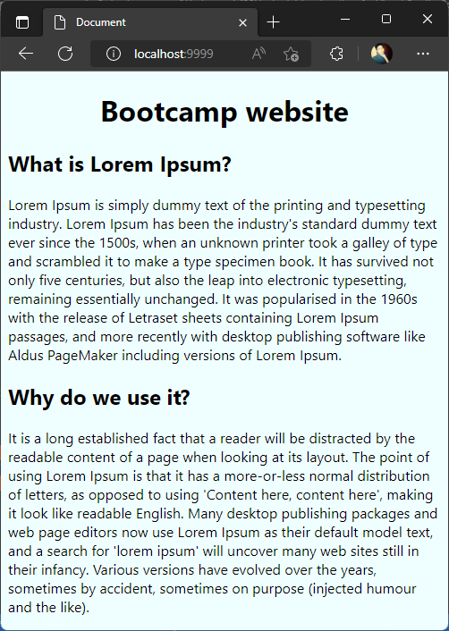
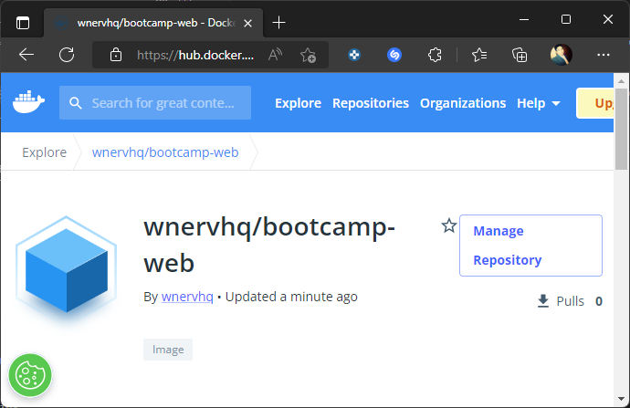
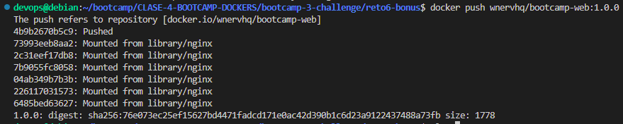
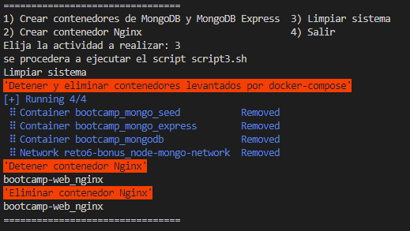

# Solución reto 6
Para resolver el ejercicio se procedio a implementar un script principal de nombre **reto6.sh** como menú gestor de scripts con diferenciones opciones a ejecutar.  

### Ejercicio 1 - Crear contenedores de `MongoDB` y `MongoDB Express`

se crea un contenedor para `MongoDB` con las siguientes caracteristicas
- **Imagen Base**: mongo:4.4 
- **Nombre Contenedor**: bootcamp_mongodb
- **Puerto**: 21017
- **Volumen**: ~/mongo:/data/db

se crea un contenedor para `MongoDB Express` con las siguientes caracteristicas
- **Imagen Base**: mongo-express 
- **Nombre Contenedor**: bootcamp_mongo_express
- **Puerto**: 8081

Crea un contenedor con `MongoDB`, protegido por usuario y contraseña.
Conectate utilizando `Mongo Express`.

https://github.com/wnervhq/bootcamp-3-challenge/blob/39468bf29c647c8dbe290a0d8fb1c3ddc7c4f939/reto6-bonus/docker-compose.yml#L1-L51

Crea una base de datos llamada `Library` con una colección llamada `Books`.
Importa los datos de [books.json]

https://github.com/wnervhq/bootcamp-3-challenge/blob/39468bf29c647c8dbe290a0d8fb1c3ddc7c4f939/reto6-bonus/Dockerfile#L1-L13

### Ejercicio 2 - Crear contenedor `Nginx`

Crea un contenedor llamado `bootcamp-web`, con `Nginx`, accesible desde `http://localhost:9999 `

https://github.com/wnervhq/bootcamp-3-challenge/blob/39468bf29c647c8dbe290a0d8fb1c3ddc7c4f939/reto6-bonus/scripts/script2.sh#L1-L19

Copia el contenido de la carpeta [bootcamp-web](https://github.com/roxsross/bootcamp-3-challenge/master/reto6-bonus/bootcamp-web) de la unidad en la ruta que sirve este servidor.

https://github.com/wnervhq/bootcamp-3-challenge/blob/39468bf29c647c8dbe290a0d8fb1c3ddc7c4f939/reto6-bonus/DockerfileWeb#L1-L6

Ejecuta `ls` desde fuera para ver que el contenido se ha copiado correctamente.

Accede a través del navegador de tu máquina.

se puede optener el contenedor con el siguiente comando
**docker pull wnervhq/bootcamp-web**

### Ejercicio 3 - Limpiar sistema

Eliminar todos los contenedores que tienes ejecutándose en tu máquina.

https://github.com/wnervhq/bootcamp-3-challenge/blob/39468bf29c647c8dbe290a0d8fb1c3ddc7c4f939/reto6-bonus/scripts/script3.sh#L1-L14

