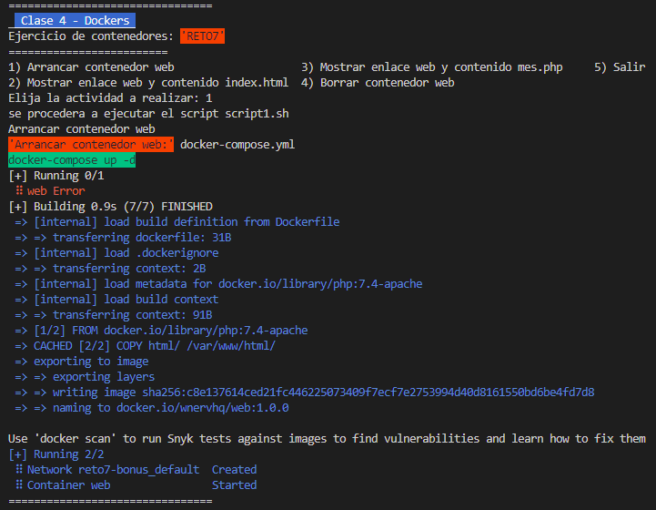
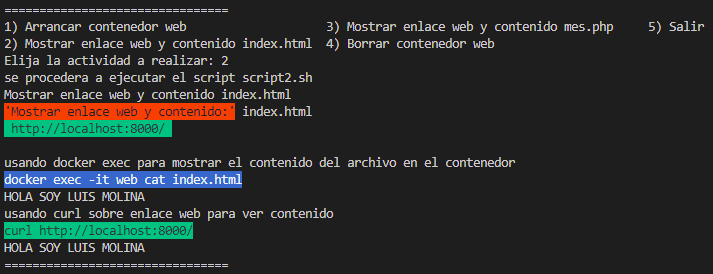
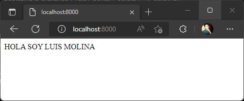
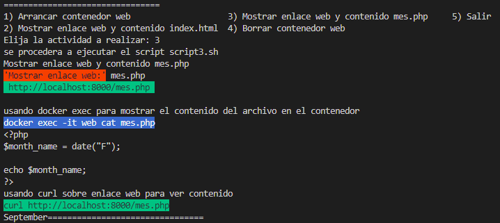
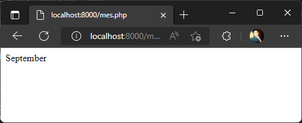
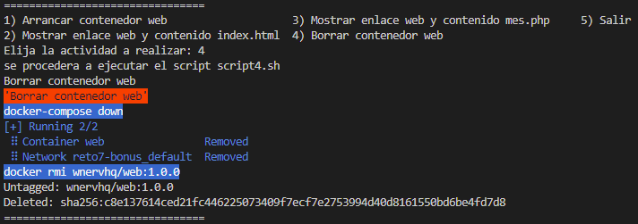

# Solución reto 7
Para resolver el ejercicio se procedio a implementar un script principal de nombre **reto7.sh** como menú gestor de scripts con diferenciones opciones a ejecutar.  

### Servidor web

1. Arrancar un contenedor que ejecute la imagen php:7.4-apache, llamado web, por el puerto 8000.

https://github.com/wnervhq/bootcamp-3-challenge/blob/7c75da96755f1a33c6bcdc68c0bd75638afbf656/reto7-bonus/docker-compose.yml#L1-L9

https://github.com/wnervhq/bootcamp-3-challenge/blob/7c75da96755f1a33c6bcdc68c0bd75638afbf656/reto7-bonus/Dockerfile#L1-L6

2. Colocar en el directorio raíz del contenedor un archivo index.html que contenga 'HOLA SOY XXXXX' (nombre y apellidos).

https://github.com/wnervhq/bootcamp-3-challenge/blob/7c75da96755f1a33c6bcdc68c0bd75638afbf656/reto7-bonus/scripts/script1.sh#L1-L6

3. Colocar en el mismo directorio otro archivo llamado llamado mes.php que muestre el mes actual, y ver la salida del script en el navegador.

https://github.com/wnervhq/bootcamp-3-challenge/blob/7c75da96755f1a33c6bcdc68c0bd75638afbf656/reto7-bonus/scripts/script3.sh#L1-L16

4. Borrar el contenedor.

https://github.com/wnervhq/bootcamp-3-challenge/blob/7c75da96755f1a33c6bcdc68c0bd75638afbf656/reto7-bonus/scripts/script4.sh#L1-L9

