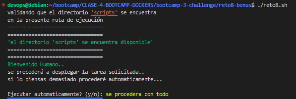
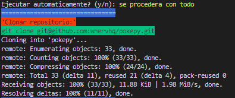
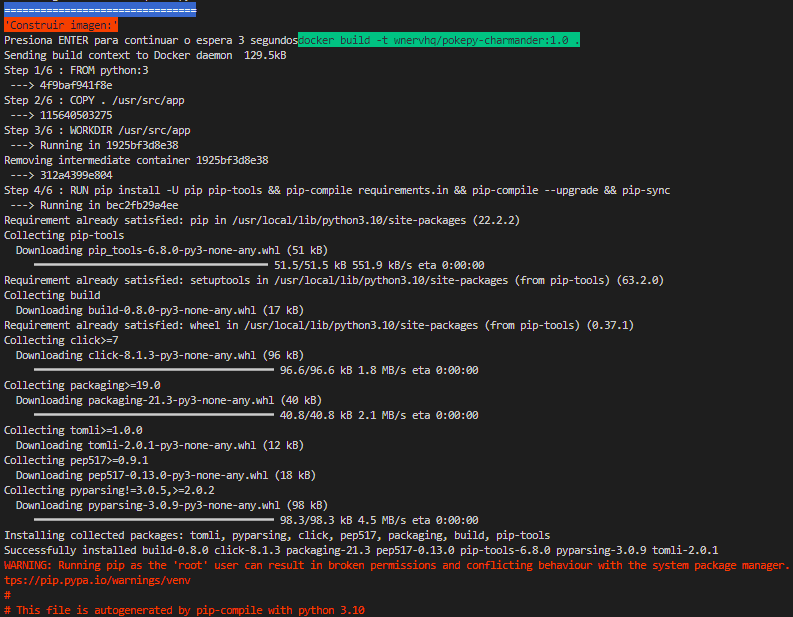
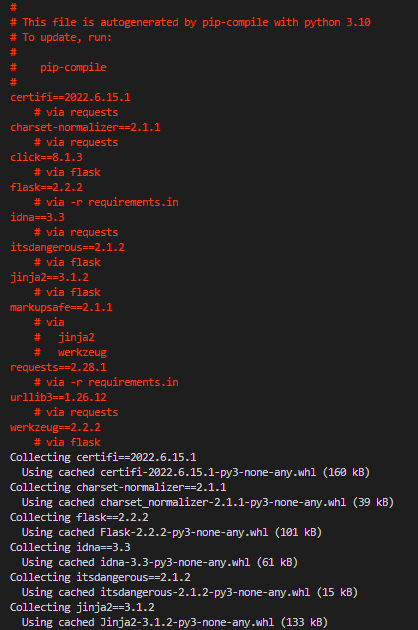
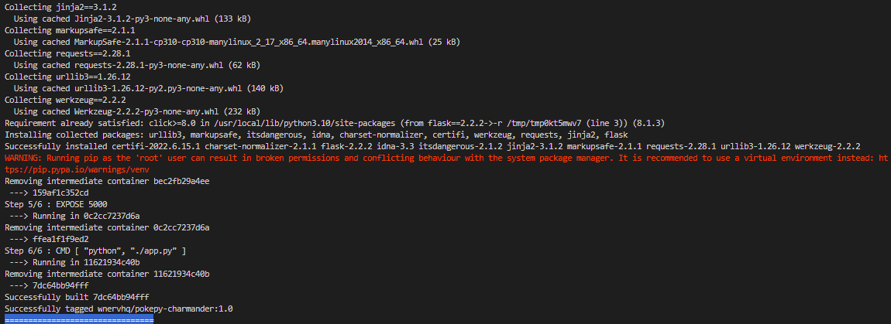
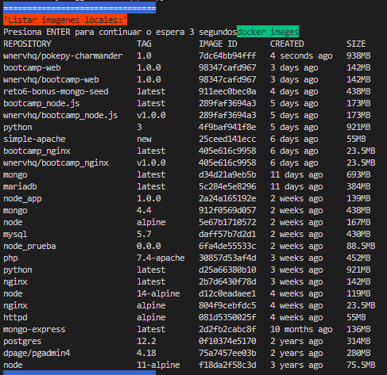
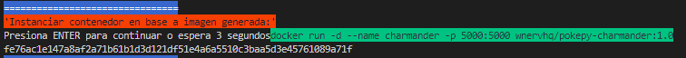
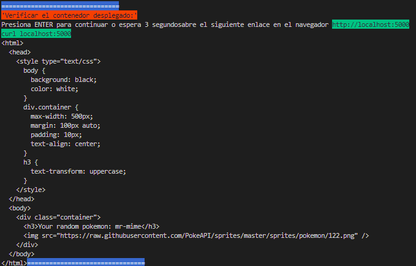
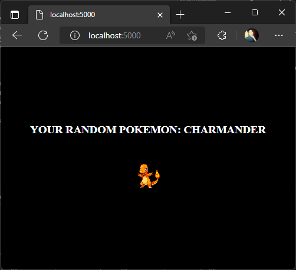
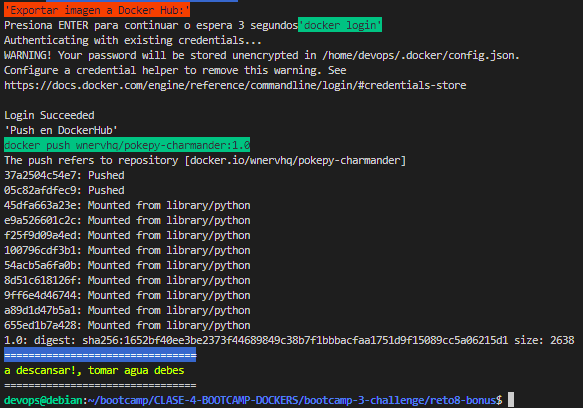

# Solución reto 8
Para resolver el ejercicio se procedio a implementar un script principal de nombre **reto8.sh** como menú gestor de scripts con diferenciones opciones a ejecutar.  

- se hizo una modificacion al archivo Dockerfile para que mejorar el manejo de paquetes del archivo requirements.txt haciendo uso de pip-compile.   
- asi mismo se agrego el archivo requirements.inv necesario para trabajar en conjunto con pip-compile   

https://github.com/wnervhq/pokepy/blob/c920e5807931c6238ddfdee3907e2e4f1989d02b/Dockerfile#L9-L14   

   

1. Clona el repositorio de <https://github.com/roxsross/pokepy> en esta ubicación  
    *nota: se hizo un fork del repositorio para usar <https://github.com/wnervhq/pokepy>

    https://github.com/wnervhq/bootcamp-3-challenge/blob/9c37afe78ecd56ae8aa48f6ff49c12ffc13b937d/reto8-bonus/scripts/script1.sh#L1-L6   
       

2. Muévete al directorio a través de la CLI y ejecuta el comando `docker build` para construir una nueva imágen de Docker en base al Dockerfile existente en el repositorio, por ejemplo `docker build -t roxsross12/pokepy-ejemplo:1.0 .`, donde `roxsross12` es el nombre de usuario en `DockerHub`, `pokepy-ejemplo` es el nombre que le vas a poner a tu imagen (puede ser cualquiera, el que tu gustes), y `1.0` la versión de tu imagen (puedes utilizar cualquier versión para este ejemplo)

    https://github.com/wnervhq/bootcamp-3-challenge/blob/9c37afe78ecd56ae8aa48f6ff49c12ffc13b937d/reto8-bonus/scripts/script2.sh#L1-L7   
      
      
      

3. Utiliza el comando `docker images` para que puedas listar todas las imágenes existentes en tu computadora o máquina host. Si te das cuenta, la nueva imagen que acabas de construir debería estar listada ahí

    https://github.com/wnervhq/bootcamp-3-challenge/blob/9c37afe78ecd56ae8aa48f6ff49c12ffc13b937d/reto8-bonus/scripts/script3.sh#L1-L7   
       

4. Instancia un contenedor en base a esa nueva imagen utilizando `docker run`

    https://github.com/wnervhq/bootcamp-3-challenge/blob/9c37afe78ecd56ae8aa48f6ff49c12ffc13b937d/reto8-bonus/scripts/script4.sh#L1-L7   
       

5. Verifica que tu contenedor está corriendo correctamente por medio de <http://localhost:5000/>

    https://github.com/wnervhq/bootcamp-3-challenge/blob/9c37afe78ecd56ae8aa48f6ff49c12ffc13b937d/reto8-bonus/scripts/script5.sh#L1-L8   
       
       

6. Esta imágen existe solamente en tu máquina host, puedes proceder a subirla a tu cuenta de docker hub utilizando el comando [`docker push`](https://docs.docker.com/engine/reference/commandline/push/) o bien, borrarla de tu máquina local con `docker rmi <image-name>`

    https://github.com/wnervhq/bootcamp-3-challenge/blob/9c37afe78ecd56ae8aa48f6ff49c12ffc13b937d/reto8-bonus/scripts/script6.sh#L1-L12   
       