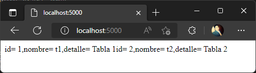

# Solución reto 9
Para resolver el ejercicio se procedio a implementar un script principal de nombre **reto9.sh** como menú gestor de scripts con diferenciones opciones a ejecutar.  

1. Se hicieron las siguientes modificaciones   
    myapp:
    - se agrego el uso de ``pip-compile`` en el archivo ``Dockerfile``
    - se agrego el archivo ``requirements.in`` para uso de ``pip-compile`` y mejorar la gestion de los paquetes   

    https://github.com/wnervhq/bootcamp-3-challenge/blob/36f91048e16ca9aa1c3ada7830e5badc5c0d863b/reto9-bonus/myapp/Dockerfile#L1-L12   

    postgres:
    - se modifico las instrucciones en el archivo ``init-db.sh`` para uso de variables, asi mismo se brindó permisos al usuario de solo lectura creado para la aplicacion   

    https://github.com/wnervhq/bootcamp-3-challenge/blob/36f91048e16ca9aa1c3ada7830e5badc5c0d863b/reto9-bonus/postgres/init-db.sh#L1-L25   

2. Se generó el archivo ``.env`` para enviar los datos sensibles y configuraciones base, en el repositorio se subio un archivo ``.env.example`` para tomarlo como referencia   

    https://github.com/wnervhq/bootcamp-3-challenge/blob/36f91048e16ca9aa1c3ada7830e5badc5c0d863b/reto9-bonus/.env.example#L1-L6   

3. Se generó el siguiente archivo ``docker-compose.yml`` para compilar el proyecto   

    https://github.com/wnervhq/bootcamp-3-challenge/blob/36f91048e16ca9aa1c3ada7830e5badc5c0d863b/reto9-bonus/docker-compose.yml#L1-L45

4. como resultado obtuvimos la aplicacion corriendo   

       

